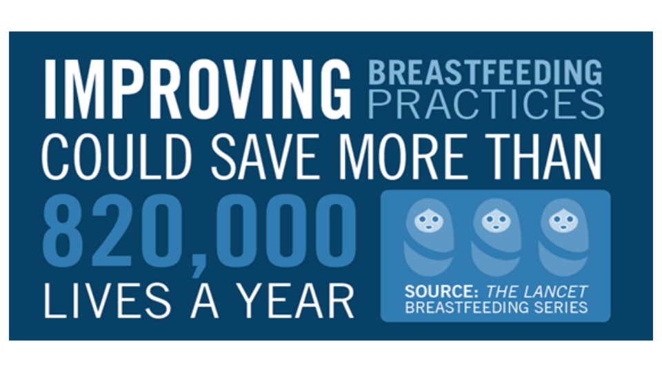
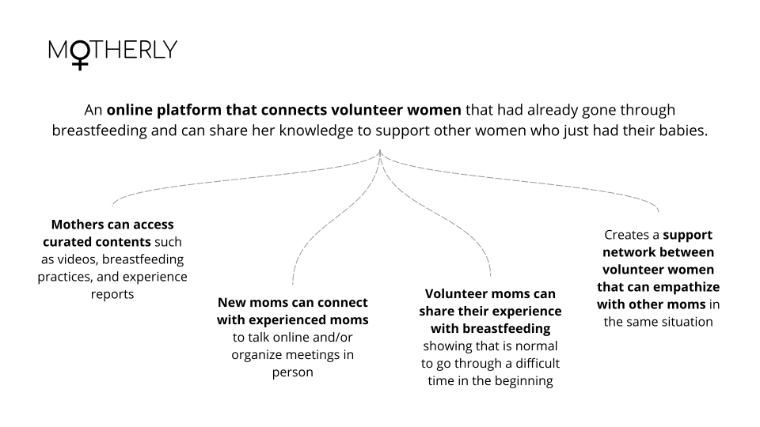
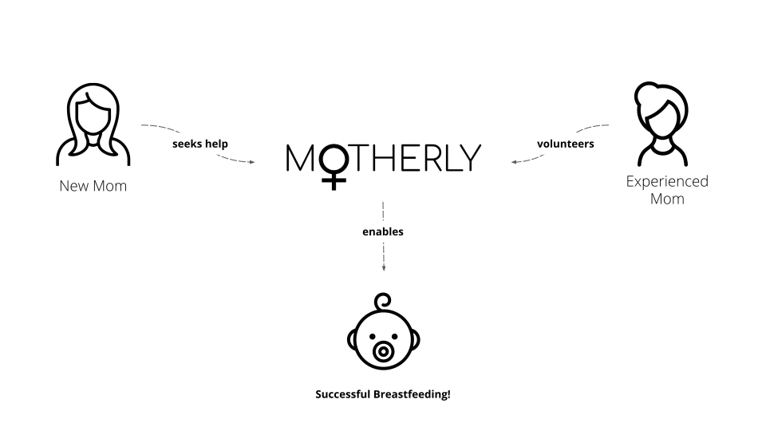
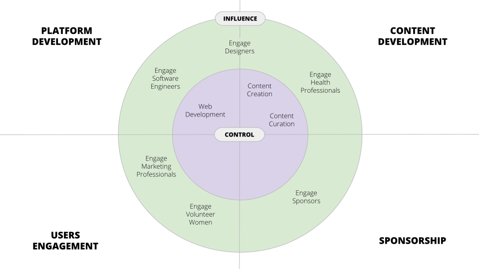
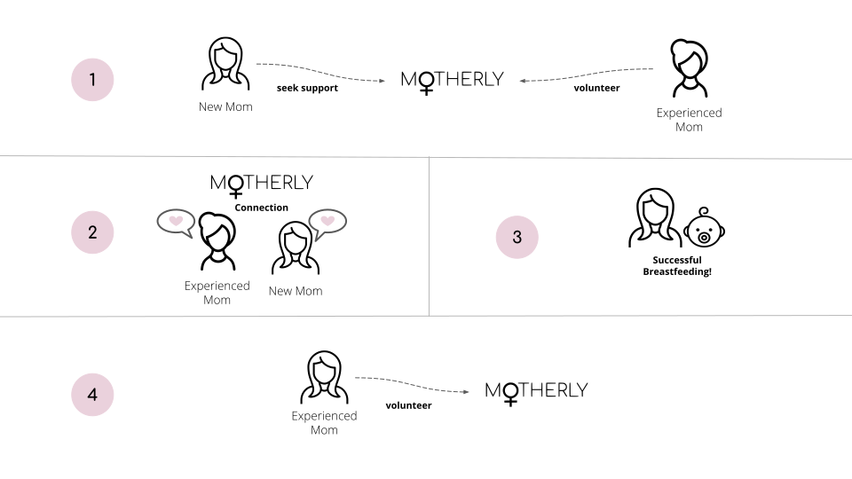

    An estimated <strong>5.3 million children under age five died in 2018</strong>.  
    Roughly, <strong>more than half</strong> of those deaths occurred in developing countries.

    Considering that, the UN established the <strong>Sustainable Development Goal 3</strong>: <em>Good Health and Well-being</em>.

    The target is, by 2030, <strong>end preventable deaths of newborns and children under 5 years of age</strong>.

---

One possible solution for child mortality is <strong>breastfeeding</strong>!

---

    "Children who are breastfed for longer periods have <strong>lower infectious morbidity and mortality</strong> [...] than do those who are breastfed for shorter periods, or not breastfed."

<a class="article-reference" href="https://www.ncbi.nlm.nih.gov/pubmed/26869575" target="_blank">
Victora GC, Bahl R, Barros AJ, França GV, Horton S, Krasevec J, et al. Breastfeeding in the 21st century: epidemiology, mechanisms, and lifelong effect. Lancet. 2016;387(10017):475-90.
</a>

  

    "Both the World Health Organization (WHO) and United Nations Children's Fund (UNICEF) <strong>recommend early initiation of breastfeeding</strong> [...]"

<a class="article-reference" href="https://www.ncbi.nlm.nih.gov/pubmed/26249674" target="_blank">
Sankar MJ, Sinha B, Chowdhury R, Bhandari N, Taneja S, Martines J, et al. Optimal breastfeeding practices and infant and child mortality: a systematic review and meta-analysis. Acta Paediatr. 2015;104(467):3-13.
</a>

---

    

    "Breastfeeding promotion is <strong>important in both rich and poor countries alike</strong>, and <strong>might contribute to achievement of the forthcoming Sustainable Development Goals</strong>."

<a class="article-reference" href="https://www.ncbi.nlm.nih.gov/pubmed/26869575" target="_blank">
Victora GC, Bahl R, Barros AJ, França GV, Horton S, Krasevec J, et al. Breastfeeding in the 21st century: epidemiology, mechanisms, and lifelong effect. Lancet. 2016;387(10017):475-90.
</a>

---

    Despite all that, breastfeeding rates globally remain low. 

    <strong>Only 40% of infants aged 6 months or less are exclusively breastfed</strong>. These numbers can be even worse in low-income and middle-income countries.

    Many <strong>new mothers are unable to breastfeed</strong> because they cannot overcome the difficulties faced in the beginning, such as: the right position of the baby, cracked nipples, and misleading information.

---

    <i class="ri-heart-line"></i>

    Breastfeeding is a very complex practice that involves more than just the mother and the baby.

    The <strong>support between women is powerful</strong>, therefore, <strong>mothers need to connect</strong>!

---

    <i class="ri-facebook-box-line"></i>
    <i class="ri-twitter-line"></i>
    <i class="ri-instagram-line"></i>

   <strong>Mothers try many ways to connect themselves</strong> seeking for support in this manner.

    There are Facebook groups about breastfeeding with<strong> thousands of women</strong>.

   In Brazil, I started an <a href="https://www.instagram.com/nutricaomaternoinfantilufmg/" target=_blank>Instagram</a> account to connect health professionals - like myself - with women in need of breastfeeding support. In a few months the account got around 280 followers, with no publicity.

---

    However, <strong>social networks are not build for breastfeeding content</strong>. This makes women uncomfortable and reduces their chances to share experiences and provide support.

    Very often, <strong>this content is classified as restricted</strong> by both artificial intelligence and human verification, <strong>implicating that it is inappropriate</strong>.

---

<h2>So...</h2>

---

    

---

    

---

    It’s already been proved that <strong>breastfeeding can reduce neonatal mortality</strong>. Motherly can connect moms who are struggling with breastfeeding and ensure that they receive the necessary support.

    Within my circle of influence <strong>I can enable connections between women to improve breastfeeding practices</strong> making them expand their support network.

    <strong>A mother that receives help through the platform can volunteer and help others</strong>. Finally, the mothers can connect their own circle of influence to help others.

---

<h2>How?</h2>

---

    

---

    

---

    <strong>Thank you!</strong>

    

        <a href="/1">RESTART PRESENTATION</a>
    

