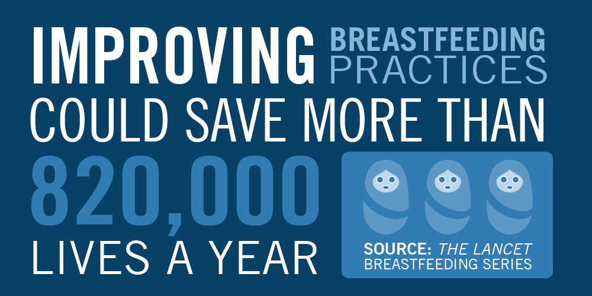

    An estimated <b>5.3 million children under age five died in 2018</b>.  
    Roughly, <b>more than half</b> of those deaths occurred in developing countries.

    Considering that, the UN established the <b>Sustainable Development Goal 3</b>: <i>Good Health and Well-being</i>.

    The target is, by 2030, <b>end preventable deaths of newborns and children under 5 years of age</b>.

---

One possible solution for child mortality is <b>breastfeeding</b>!

---

    "Children who are breastfed for longer periods have <b>lower infectious morbidity and mortality</b> [...] than do those who are breastfed for shorter periods, or not breastfed."

<a class="article-reference" href="https://www.ncbi.nlm.nih.gov/pubmed/26869575" target="_blank">
Victora GC, Bahl R, Barros AJ, França GV, Horton S, Krasevec J, et al. Breastfeeding in the 21st century: epidemiology, mechanisms, and lifelong effect. Lancet. 2016;387(10017):475-90.
</a>

  

    "Both the World Health Organization (WHO) and United Nations Children's Fund (UNICEF) <b>recommend early initiation of breastfeeding</b> [...]"

<a class="article-reference" href="https://www.ncbi.nlm.nih.gov/pubmed/26249674" target="_blank">
Sankar MJ, Sinha B, Chowdhury R, Bhandari N, Taneja S, Martines J, et al. Optimal breastfeeding practices and infant and child mortality: a systematic review and meta-analysis. Acta Paediatr. 2015;104(467):3-13.
</a>

---

    "Breastfeeding promotion is <b>important in both rich and poor countries alike</b>, and <b>might contribute to achievement of the forthcoming Sustainable Development Goals</b>."

 

---

    Despite all that, breastfeeding rates globally remain low. 

    Only 43% of the world's newborns are put to the breast within 1 hour of birth and 40% of infants aged 6 months or less are exclusively breastfed. These numbers can be even worse in low-income and middle-income countries.

    Many new mothers are unable to breastfeed because they cannot overcome the difficulties faced when initiating breastfeeding. Some of this difficulties are the right position of the baby, cracked nipples, and misleading information.

